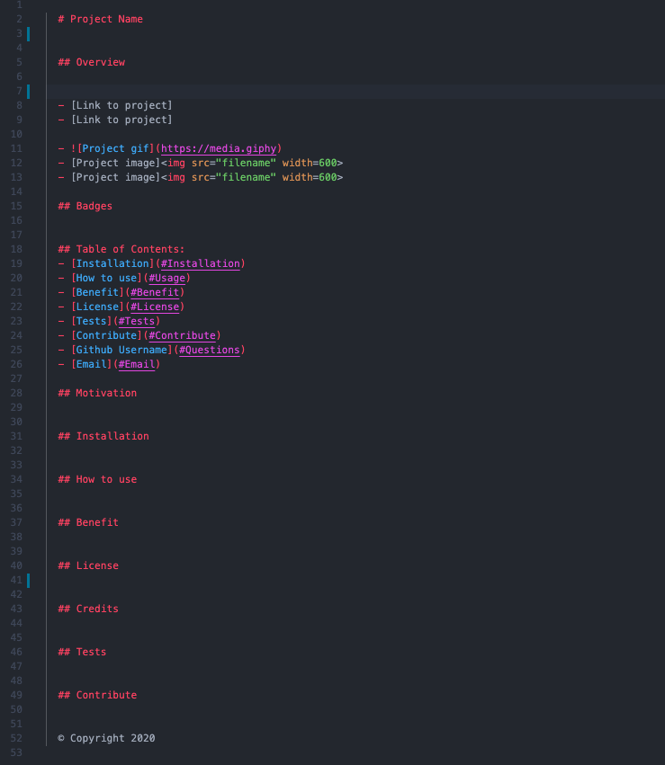
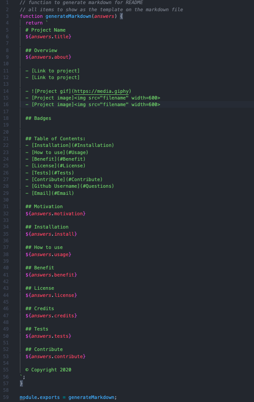

  # Project Name 
  Readme Generator

  ## Overview 
  Easily accessible readme template for any project.

  ## Table of Contents:
  - [Links to github project](#Links)
  - [Screenshots and GIFs](#Screenshots)
  - [Installation](#Install)
  - [How to use](#Usage)
  - [Benefit](#Benefit)
  - [License](#License)
  - [Credits](#Credits)
  - [Tests](#Tests)
  - [Contribute](#Contribute)

  ## Links
  - (https://jmeggles.github.io/09_Readme_Generator/)
  - (https://github.com/jmeggles/09_Readme_Generator)

  ## Screenshots and GIFs
  - 
  - 
  - 

   ## Motivation
  This project is to make readmes quicker and easier to complete.

  ## Installation  
  Use npm inquirer package.

  ## How to use
  After installing npm, run node and filename then answer all questions when prompted to generate the readme.

  ## Benefit
  Anyone!  This is a template for all github projects.

  ## License 
  MIT

  ## Credits
  John Dinsmore, Jorge Alvarez, Ben Benson, W3 Schools

  ## Tests
  No tests yet.

  ## Contribute
  Anyone can change, add, or comment on the project in gthub.

  © Copyright 2020
